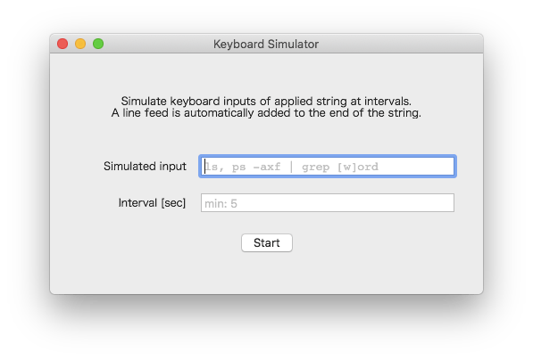

[日本語](./README_JP.md)

# KeyboardSimulator

Application to simulate keyboard inputs at intervals for macOS.

## Overview

1. Apply simulated inputs
   - Apply string into "simulated inputs" filed.
   - Definition of available characters are in [this file](./KeyboardSimulator/Classes/KeyEvent.swift).
1. Apply interval 
   - Apply value representing intervals between each inputs.
   - Value of interval cannot be over 5 seconds so as to prevent dangerous behavior.
1. Start
   - String is automatically inserted into focused field as a result of simulating keyboard event.
1. Stop
   - Simulation stops.

## Technology

Class [KeyboardSimulator](./KeyboardSimulator/Classes/KeyboardSimulator.swift) creates and posts events.

Event representing key event is created by initializer `init(keyboardEventSource:virtualKey:keyDown:)` of [CGEvent](https://developer.apple.com/documentation/coregraphics/cgevent) and posted by [post(tap:)](https://developer.apple.com/documentation/coregraphics/cgevent/1456527-post).

All of definition of Virtual keycodes applied when creating `CGEvent` can be checked in the file  `/System/Library/Frameworks/Carbon.framework/Versions/A/Frameworks/HIToolbox.framework/Versions/A/Headers/Events.h`.
