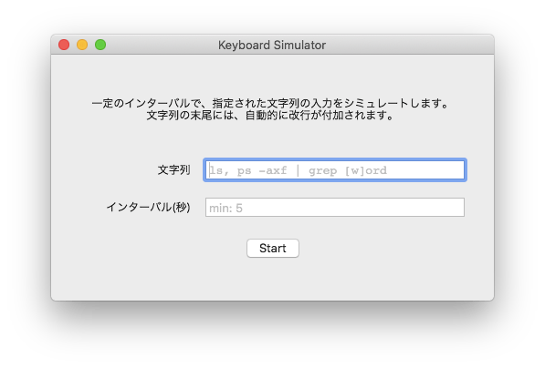

# KeyboardSimulator

一定の時間間隔でUSキーボードの入力をシミュレートするmacOS用のアプリケーションです。

## 概要

1. 文字列の指定
   -  シミュレートしたい文字列を「文字列」のフィールドに指定します。
   - 使用できる文字の定義の一覧は[こちらのファイル](./KeyboardSimulator/Classes/KeyEvent.swift)にあります。
1. インターバルの指定
   - シミュレート間の時間間隔を「インターバル」のフィールドに指定します。
   - インターバルが短すぎると危険なので、5秒以下には設定できないようにしています。
1. スタート
   - キーボードの入力イベントを発行した結果として、GUI上の入力カーソルの位置に自動的に文字列が入力されます。
   - キーボード入力が「ひらがな」などになっているとおかしなことになります。
1. ストップ
   - 止まります。

## 技術

クラス [KeyboardSimulator](./KeyboardSimulator/Classes/KeyboardSimulator.swift) でイベントの生成と発行を行っています。

[CGEvent](https://developer.apple.com/documentation/coregraphics/cgevent) のイニシャライザ `init(keyboardEventSource:virtualKey:keyDown:)` でキー操作のイベントを表わすイベントを生成し、[post(tap:)](https://developer.apple.com/documentation/coregraphics/cgevent/1456527-post)でイベントを発行します。

`CGEvent` の生成時に指定する Virtual keycodes の定義一覧は、 `/System/Library/Frameworks/Carbon.framework/Versions/A/Frameworks/HIToolbox.framework/Versions/A/Headers/Events.h` で確認することができます。
